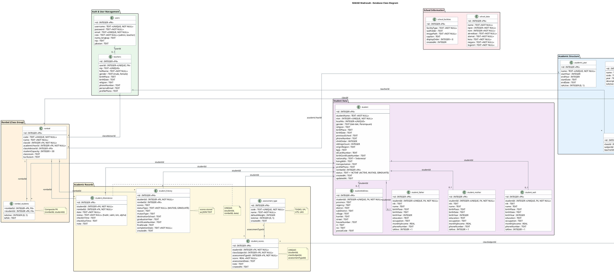

# Class Diagram - SIAKAD Madrasah

```plantuml
@startuml SIAKAD_Madrasah_Class_Diagram

skinparam classAttributeIconSize 0
skinparam linetype ortho
skinparam nodesep 60
skinparam ranksep 40
skinparam class {
  BackgroundColor #FEFEFE
  BorderColor #334155
  ArrowColor #475569
  FontSize 12
}

title SIAKAD Madrasah - Database Class Diagram

' ============================================================
' AUTH & USER MANAGEMENT
' ============================================================

package "Auth & User Management" #E8F5E9 {

  class users {
    + id : INTEGER <<PK>>
    --
    username : TEXT <<UNIQUE, NOT NULL>>
    password : TEXT <<NOT NULL>>
    email : TEXT <<UNIQUE, NOT NULL>>
    role : TEXT <<NOT NULL>> {admin, teacher}
    nama_lengkap : TEXT
    nip : TEXT
    jabatan : TEXT
  }

  class teachers {
    + id : INTEGER <<PK>>
    --
    userId : INTEGER <<UNIQUE, FK>>
    nip : TEXT <<UNIQUE>>
    fullName : TEXT <<NOT NULL>>
    gender : TEXT {male, female}
    birthPlace : TEXT
    birthDate : TEXT
    religion : TEXT
    phoneNumber : TEXT
    personalEmail : TEXT
    profilePhoto : TEXT
  }

}

' ============================================================
' ACADEMIC STRUCTURE
' ============================================================

package "Academic Structure" #E3F2FD {

  class academic_year {
    + id : INTEGER <<PK>>
    --
    name : TEXT <<UNIQUE, NOT NULL>>
    startYear : INTEGER
    endYear : INTEGER
    startDate : TEXT
    endDate : TEXT
    isActive : INTEGER {0, 1}
  }

  class curriculum {
    + id : INTEGER <<PK>>
    --
    name : TEXT <<NOT NULL>>
    code : TEXT <<UNIQUE, NOT NULL>>
    year : TEXT <<NOT NULL>>
    description : TEXT
    isActive : INTEGER {0, 1}
  }

  class classes {
    + id : INTEGER <<PK>>
    --
    className : TEXT <<NOT NULL>>
  }
  note right of classes : Grade level\n(X, XI, XII)

  class subjects {
    + id : INTEGER <<PK>>
    --
    name : TEXT <<UNIQUE, NOT NULL>>
    subjectCode : TEXT <<UNIQUE>>
    description : TEXT
    kkm : INTEGER = 75
  }

  class class_subject {
    + id : INTEGER <<PK>>
    --
    classId : INTEGER <<FK, NOT NULL>>
    subjectId : INTEGER <<FK, NOT NULL>>
    teacherId : INTEGER <<FK>>
  }

}

' ============================================================
' ROMBEL (CLASS GROUP)
' ============================================================

package "Rombel (Class Group)" #FFF3E0 {

  class rombel {
    + id : INTEGER <<PK>>
    --
    code : TEXT <<UNIQUE, NOT NULL>>
    name : TEXT <<NOT NULL>>
    classId : INTEGER <<FK, NOT NULL>>
    academicYearId : INTEGER <<FK, NOT NULL>>
    classAdvisorId : INTEGER <<FK>>
    studentCapacity : INTEGER = 30
    classroom : TEXT
    kurikulum : TEXT
  }

  class rombel_students {
    + rombelId : INTEGER <<PK, FK>>
    + studentId : INTEGER <<PK, FK>>
    --
    isActive : INTEGER {0, 1}
    leftAt : TEXT
  }
  note right of rombel_students : Composite PK\n(rombelId, studentId)

}

' ============================================================
' STUDENT DATA
' ============================================================

package "Student Data" #F3E5F5 {

  class student {
    + id : INTEGER <<PK>>
    --
    studentName : TEXT <<NOT NULL>>
    nisn : INTEGER <<UNIQUE, NOT NULL>>
    localNis : INTEGER <<UNIQUE>>
    gender : TEXT {laki-laki, Perempuan}
    religion : TEXT
    birthPlace : TEXT
    birthDate : TEXT
    previousSchool : TEXT
    phoneNumber : TEXT
    childOrder : INTEGER
    siblingsCount : INTEGER
    originRegion : TEXT
    bpjs : TEXT
    idCardNumber : TEXT
    birthCertificateNumber : TEXT
    nationality : TEXT = 'Indonesia'
    livingWith : TEXT
    transportation : TEXT
    profilePhoto : TEXT
    rombelId : INTEGER <<FK>>
    status : TEXT = 'ACTIVE' {ACTIVE, MUTASI, GRADUATE}
    createdAt : TEXT
    updatedAt : TEXT
  }

  class studentAddress {
    + id : INTEGER <<PK>>
    --
    studentId : INTEGER <<UNIQUE, FK, NOT NULL>>
    province : TEXT
    regency : TEXT
    district : TEXT
    subDistrict : TEXT
    village : TEXT
    hamlet : TEXT
    street : TEXT
    houseNumber : TEXT
    rt : TEXT
    rw : TEXT
    postalCode : TEXT
  }

  class student_father {
    + id : INTEGER <<PK>>
    --
    studentId : INTEGER <<UNIQUE, FK, NOT NULL>>
    nik : TEXT
    name : TEXT
    birthPlace : TEXT
    birthDate : TEXT
    birthYear : INTEGER
    education : TEXT
    occupation : TEXT
    monthlyIncome : REAL
    phoneNumber : TEXT
    isAlive : INTEGER = 1
  }

  class student_mother {
    + id : INTEGER <<PK>>
    --
    studentId : INTEGER <<UNIQUE, FK, NOT NULL>>
    nik : TEXT
    name : TEXT
    birthPlace : TEXT
    birthDate : TEXT
    birthYear : INTEGER
    education : TEXT
    occupation : TEXT
    monthlyIncome : REAL
    phoneNumber : TEXT
    isAlive : INTEGER = 1
  }

  class student_wali {
    + id : INTEGER <<PK>>
    --
    studentId : INTEGER <<UNIQUE, FK, NOT NULL>>
    nik : TEXT
    name : TEXT
    birthPlace : TEXT
    birthDate : TEXT
    birthYear : INTEGER
    education : TEXT
    occupation : TEXT
    monthlyIncome : REAL
    phoneNumber : TEXT
    isAlive : INTEGER = 1
  }

}

' ============================================================
' ACADEMIC RECORDS
' ============================================================

package "Academic Records" #FFF8E1 {

  class assessment_type {
    + id : INTEGER <<PK>>
    --
    code : TEXT <<UNIQUE, NOT NULL>>
    name : TEXT <<NOT NULL>>
    defaultWeight : INTEGER
    isActive : INTEGER {0, 1}
    createdAt : TEXT
  }
  note right of assessment_type : TUGAS, UH,\nUTS, UAS

  class student_scores {
    + id : INTEGER <<PK>>
    --
    studentId : INTEGER <<FK, NOT NULL>>
    classSubjectId : INTEGER <<FK, NOT NULL>>
    assessmentTypeId : INTEGER <<FK, NOT NULL>>
    score : REAL <<NOT NULL>>
    assessmentDate : TEXT
    note : TEXT
    createdAt : TEXT
  }
  note right of student_scores : UNIQUE:\n(studentId,\nclassSubjectId,\nassessmentTypeId)

  class student_Attendance {
    + id : INTEGER <<PK>>
    --
    studentId : INTEGER <<FK, NOT NULL>>
    rombelId : INTEGER <<FK, NOT NULL>>
    date : TEXT <<NOT NULL>>
    status : TEXT <<NOT NULL>> {hadir, sakit, izin, alpha}
    checkInTime : TEXT
    checkOutTime : TEXT
    note : TEXT
  }
  note right of student_Attendance : UNIQUE:\n(studentId,\nrombelId, date)

  class student_history {
    + id : INTEGER <<PK>>
    --
    studentId : INTEGER <<FK, NOT NULL>>
    rombelId : INTEGER <<FK>>
    scores : TEXT
    statusType : TEXT <<NOT NULL>> {MUTASI, GRADUATE}
    reason : TEXT
    mutasiType : TEXT
    destinationSchool : TEXT
    graduationYear : TEXT
    certificateNumber : TEXT
    finalGrade : TEXT
    completionDate : TEXT <<NOT NULL>>
    createdAt : TEXT
  }
  note right of student_history : scores stored\nas JSON TEXT

}

' ============================================================
' SCHOOL INFORMATION
' ============================================================

package "School Information" #FFEBEE {

  class school_data {
    + id : INTEGER <<PK>>
    --
    name : TEXT <<NOT NULL>>
    npsn : INTEGER <<NOT NULL>>
    nsm : INTEGER <<NOT NULL>>
    akreditasi : TEXT <<NOT NULL>>
    alamat : TEXT <<NOT NULL>>
    kota : TEXT <<NOT NULL>>
    negara : TEXT <<NOT NULL>>
    logoUrl : TEXT <<NOT NULL>>
  }

  class school_facilities {
    + id : INTEGER <<PK>>
    --
    facilityType : TEXT <<NOT NULL>>
    subFolder : TEXT
    imagePath : TEXT <<NOT NULL>>
    caption : TEXT
    displayOrder : INTEGER = 0
    createdAt : INTEGER
  }

}

' ============================================================
' AUDIT
' ============================================================

package "Audit" #ECEFF1 {

  class audit_logs {
    + id : INTEGER <<PK>>
    --
    audit_type : TEXT <<NOT NULL>>
    user_id : TEXT <<NOT NULL>>
    action : TEXT <<NOT NULL>>
    target : TEXT
    status : TEXT <<NOT NULL>>
    metadata : TEXT
    ip_address : TEXT
    user_agent : TEXT
    timestamp : INTEGER
  }

}

' ============================================================
' RELATIONSHIPS
' ============================================================

' Auth
users "1" -- "0..1" teachers : userId

' Academic Structure
classes "1" -- "*" rombel : classId
academic_year "1" -- "*" rombel : academicYearId
teachers "1" -- "*" rombel : classAdvisorId
classes "1" -- "*" class_subject : classId
subjects "1" -- "*" class_subject : subjectId
teachers "1" -- "*" class_subject : teacherId

' Rombel - Students (Many-to-Many)
rombel "1" -- "*" rombel_students : rombelId
student "1" -- "*" rombel_students : studentId

' Student Relations (One-to-One)
student "1" -- "0..1" studentAddress : studentId
student "1" -- "0..1" student_father : studentId
student "1" -- "0..1" student_mother : studentId
student "1" -- "0..1" student_wali : studentId

' Academic Records
student "1" -- "*" student_scores : studentId
class_subject "1" -- "*" student_scores : classSubjectId
assessment_type "1" -- "*" student_scores : assessmentTypeId

student "1" -- "*" student_Attendance : studentId
rombel "1" -- "*" student_Attendance : rombelId

student "1" -- "*" student_history : studentId
rombel "1" -- "*" student_history : rombelId

@enduml
```